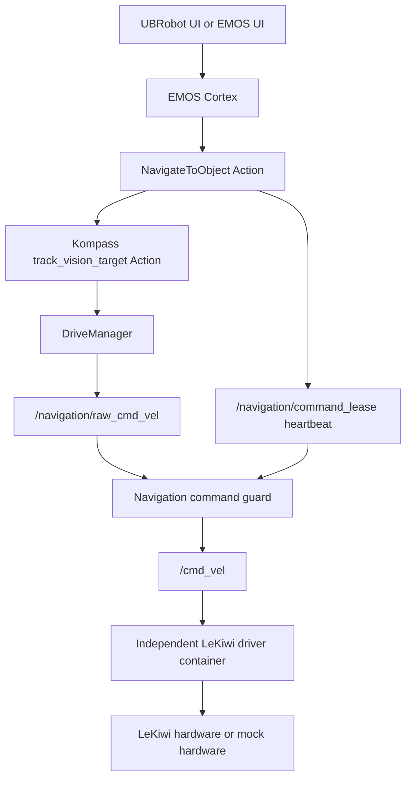

# Cortex Navigation Capability Design

## Scope

The first milestone replaces UBRobot's `nav:` prefix path with a Cortex-planned,
ROS 2 Action-based navigation capability. A user can request a task such as
"follow the chair" or "move toward the person". Cortex selects the
`NavigateToObject` capability, the capability delegates tracking to Kompass,
and the independent LeKiwi driver enforces final velocity limits.

This milestone supports vision-target navigation only. It does not add global
maps, named locations, Nav2, manipulation, or arbitrary velocity tools.

## Requirements

### Functional

- Accept a target label and bounded timeout as a ROS 2 Action goal.
- Reject empty, oversized, non-finite, or out-of-range goal fields.
- Delegate exactly one downstream `/track_vision_target` goal.
- Relay useful phase, distance-error, and orientation-error feedback.
- Cancel the downstream goal when the outer goal is cancelled or times out.
- Return an explicit success, cancelled, timed-out, rejected, or failed result.
- Expose the capability to Cortex as a discoverable navigation tool.
- Keep the current vision-depth recipe available for rollback.

### Non-functional and safety

- Cortex and other LLM-controlled code never publish `/cmd_vel`.
- Only one navigation goal may own command authority at a time.
- Raw command and capability-heartbeat age limits are at most 250 ms.
- Revoking authority emits zero immediately and continues emitting zero long
  enough for the downstream driver watchdog to observe it.
- A capability node crash must remove command authority without relying on
  graceful cleanup.
- The existing LeKiwi clamp (0.05 m/s linear, 0.20 rad/s angular) and 250 ms
  watchdog remain authoritative.
- Mock integration must pass before any hardware-mode work is planned.
- Logs identify outer goal, downstream goal, state transitions, cancellation,
  timeout, and command-lease changes without logging images or secrets.

## Architecture



### Package ownership

- `ubrobot_interfaces`: stable Action definitions shared by Cortex-facing and
  execution nodes.
- `ubrobot_navigation`: goal validation, Kompass Action adapter, command lease,
  and command guard.
- `emos_bringup`: sensor-chain launch and launch-time composition only.
- `deploy/emos/recipes/cortex_navigation`: Vision, Kompass, and Cortex recipe.
- `lekiwi_bringup` / `lekiwi_hardware`: unchanged hardware execution boundary.

## Action contract

`NavigateToObject.action`:

```text
string target
float32 timeout_sec
---
uint8 SUCCEEDED=0
uint8 CANCELLED=1
uint8 TIMED_OUT=2
uint8 REJECTED=3
uint8 FAILED=4
uint8 status
string message
---
string phase
float32 distance_error
float32 orientation_error
```

Accepted `timeout_sec` is 1-300 seconds. `target` is trimmed, must be 1-128
characters, and is treated as data rather than a shell or Python expression.

## Command authority

DriveManager is remapped to `/navigation/raw_cmd_vel`. The guard subscribes to
that topic and to a capability heartbeat carrying an opaque goal identifier.
It forwards commands only if both inputs are fresh and the identifier matches
the active lease. Otherwise it publishes zero. The lease is not a safety claim
from Cortex: it is created and refreshed only by the deterministic capability
server while an accepted outer Action goal is active.

The guard validates finite numbers and applies an EMOS-side development clamp
no larger than the driver clamp. The driver remains the last enforcement point.

## Lifecycle and failure handling

1. Validate and accept one outer goal.
2. Acquire a command lease, initially forwarding zero only.
3. Send the Kompass goal and wait for acceptance.
4. Refresh the lease while relaying feedback.
5. On success, cancellation, timeout, or failure, cancel the downstream goal
   where applicable, revoke the lease, publish zero, and complete the result.
6. If the capability process disappears, heartbeats expire and the guard stops.
7. If the guard disappears, the driver receives no new command and its 250 ms
   watchdog stops the base.

No container or driver restart is used as ordinary goal cancellation.

## Cortex integration

The implementation first runs a compatibility probe against the deployed EMOS
0.7.0 image. Cortex must discover the new ROS Action through the supported
managed-component entrypoint API. If 0.7.0 cannot monitor this external action
asynchronously, build a separate development image pinned to a verified EMOS
version; do not patch the production container in place.

Cortex tool instructions describe navigation outcomes and constraints, but do
not mention `/cmd_vel`, torque, serial devices, or motor IDs. The UI submits
plain-language tasks to Cortex and displays the Cortex plan, Action feedback,
and final result.

## Verification gates

1. Pure unit tests for goal validation and guard state transitions.
2. ROS integration tests proving feedback, cancellation, timeout, and mutual
   exclusion with fake downstream Action and command publishers.
3. EMOS recipe smoke test with no LeKiwi driver.
4. Cross-container mock test with the LeKiwi mock driver.
5. Restart/cancellation fault injection proving `/cmd_vel` becomes and remains
   zero.
6. Only after a separate reviewed hardware-test plan: lifted-wheel and then
   bounded ground motion.

